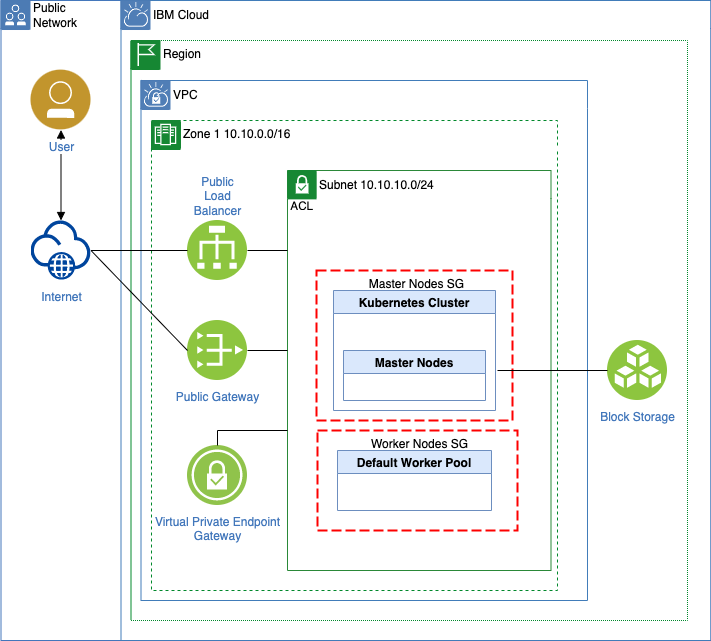
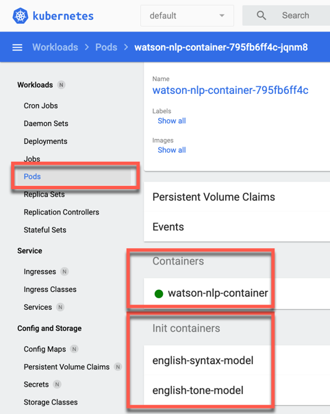

# Run Watson STT for Embed on an IBM Cloud Kubernetes cluster

This example project has two objectives.

* Create an IBM Cloud Kubernetes cluster in a [`Virtual Private Cloud` (VPC) environment](https://www.ibm.com/topics/vpc) with [Terraform](https://www.terraform.io/)
* Deploy [Watson STT for embed`](https://www.ibm.com/docs/en/watson-libraries?topic=watson-speech-text-library-embed-home) to the created cluster with [Helm](https://helm.sh/), but a bit different to the IBM documentation here [`Run with Helm Charts`](https://www.ibm.com/docs/en/watson-libraries?topic=containers-run-helm-chart).


The example project reuses code from project [`Use Terraform to create a VPC and a Kubernetes Cluster on IBM Cloud`](https://github.com/thomassuedbroecker/terraform-vpc-kubernetes).

> Visit the related blog post [`Run Watson NLP for Embed on an IBM Cloud Kubernetes cluster in a Virtual Private Cloud environment`](https://suedbroecker.net/2023/01/12/run-watson-nlp-for-embed-on-an-ibm-cloud-kubernetes-cluster-in-a-virtual-private-cloud-environment/).

### Simplified IBM Cloud architecture diagram

Terraform will create and configure on IBM Cloud:

* 1 x VPC

    * 3 x Security Groups

      * 1 x Default
      * 2 x Related to the Kubernetes Cluster (created by the Kubernetes Service creation)
    
    * 1 x Access control list
    * 1 x Routing table
    * 1 x Public gateway
    * 1 x Virtual Private Endpoint Gateway (created by the Kubernetes Service creation)
    * 1 x Public load balancer (created by the Kubernetes Service creation)

* 1 x Kubernetes Cluster 

    * Including 3 [fully IBM managed master nodes](https://cloud.ibm.com/docs/containers?topic=containers-cs_ov)
    * Configured 2 Worker nodes (managed by IBM) ([see responsibilities](https://cloud.ibm.com/docs/containers?topic=containers-responsibilities_iks))
    * Enabled [Block Storage for VPC](http://ibm.biz/addon-state)
    * Enabled service endpoint for public and private communication

This is a simplified diagram of the created infrastructure with terraform.



### Prerequisites

To use the bash automation you need to have  following tools to be installed on your local computer: 

* [IBM Cloud CLI](https://cloud.ibm.com/docs/cli?topic=cli-getting-started)
* Plugin VPC infrastructure
* Plugin Container-service
* [Terraform](https://www.terraform.io/)
* [Helm](https://helm.sh/)
* [kubectl](https://kubernetes.io/de/docs/tasks/tools/install-kubectl/)

## Example setup

The example setup contains two bash automations:

* [One for Terraform](https://github.com/thomassuedbroecker/terraform-vpc-kubernetes-watson-stt/tree/main/code/terraform_setup)
* [One for Helm](https://github.com/thomassuedbroecker/terraform-vpc-kubernetes-watson-stt/tree/main/code/helm_setup)

### Step 1: Clone the repo

```sh
git clone https://github.com/thomassuedbroecker/terraform-vpc-kubernetes-watson-stt.git
cd terraform-vpc-kubernetes-watson-stt
```

## Create the Kubernetes cluster and VPC

### Step 1: Navigate to the `terraform_setup`

```sh
cd code/terraform_setup
```

### Step 2: Create a `.env` file

```sh
cat .env_template > .env
```

### Step 3: Add an IBM Cloud access key to your local `.env` file

```sh
nano .env
```

Content of the file:

```sh
export IC_API_KEY=YOUR_IBM_CLOUD_ACCESS_KEY
export REGION="us-east"
export GROUP="tsuedbro"
```

### Step 4: Verify the global variables in the bash script automation 

Inspect the bash automation [`create_vpc_kubernetes_cluster_with_terraform.sh`](https://github.com/thomassuedbroecker/terraform-vpc-kubernetes-watson-nlp/blob/main/code/terraform_setup/create_vpc_kubernetes_cluster_with_terraform.sh) and adjust the values to your need.

```sh
nano create_vpc_kubernetes_cluster_with_terraform.sh
```

```sh
#export TF_LOG=debug
export TF_VAR_flavor="bx2.4x16"
export TF_VAR_worker_count="2"
export TF_VAR_kubernetes_pricing="tiered-pricing"
export TF_VAR_resource_group=$GROUP
export TF_VAR_vpc_name="watson-stt-tsuedbro"
export TF_VAR_region=$REGION
export TF_VAR_kube_version="1.25.5"
export TF_VAR_cluster_name="watson-stt-tsuedbro"
```

### Step 5: Execute the bash automation

>The creation can take up to 1 hour, depending on the region you use.

```sh
sh create_vpc_kubernetes_cluster_with_terraform.sh
```

* Example output:

```sh
...
Apply complete! Resources: 5 added, 0 changed, 0 destroyed.
*********************************
```

## Deploy Watson NLP embed with Helm

### Step 1: Navigate to the `helm_setup`

```sh
cd code/helm_setup
```

### Step 2: Create a `.env` file

```sh
cat .env_template > .env
```

### Step 3: Add an IBM Cloud access key to your local `.env` file

```sh
export IC_API_KEY=YOUR_IBM_CLOUD_ACCESS_KEY
export IBM_ENTITLEMENT_KEY="YOUR_KEY"
export IBM_ENTITLEMENT_EMAIL="YOUR_EMAIL"
export CLUSTER_ID="YOUR_CLUSTER"
export REGION="us-east"
export GROUP="tsuedbro"
```

### Step 4: Execute the bash automation

> _Note:_[Watson Speech to Text API documentation](https://cloud.ibm.com/docs/speech-to-text?topic=speech-to-text-about)

```sh
sh deploy-watson-stt-to-kubernetes.sh
```

The script does following steps and the links are pointing to the relevant function in the bash automation:

1. [Log on to IBM Cloud with an IBM Cloud API key.](TBD)
2. [It ensures that is connected to the cluster.](TBD)
3. [It creates a `Docker Config File` which will be used to create a pull secret.](TBD)
4. [It installs the Helm chart for Watson STT embed configured for REST API usage.](TBD)
5. [It verifies that the container is running and invokes a REST API call inside the `runtime-container` of Watson STT emded.](TBD)
6. [It verifies that the exposed Kubernetes `URL` with a `load balancer service` is working and invokes a the same REST API call as before from the local machine.](TBD)

* Example output:

```sh

TBD

```

The image below shows the running container on the Kubernetes cluster.



